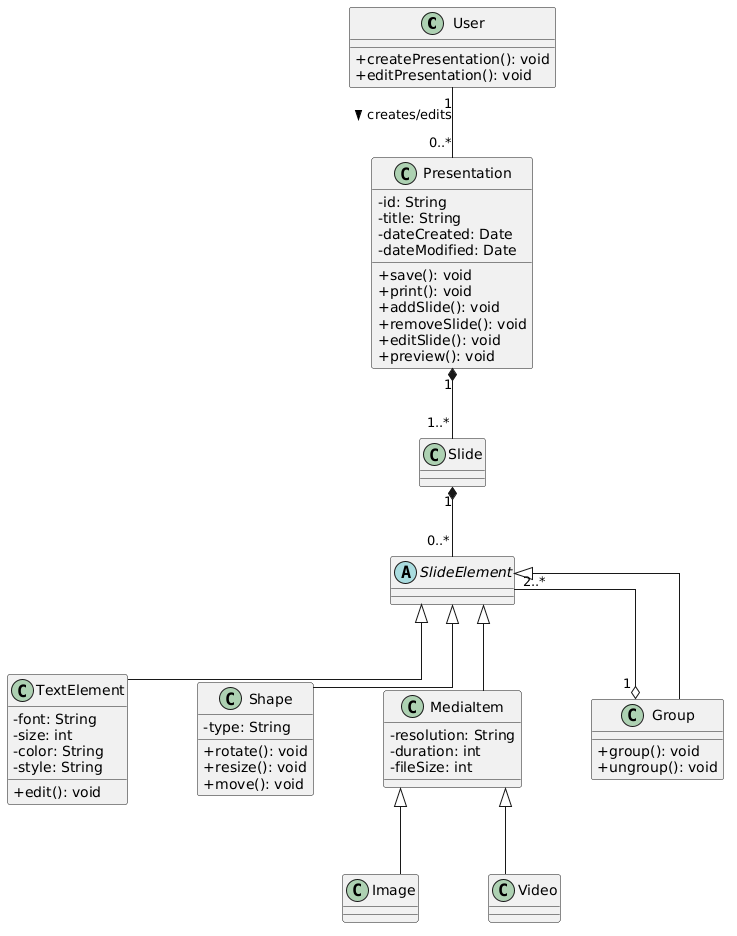

# System Static Architecture Analysis

## Class Definitions
The following technical list details all the core architectural classes identified from the Smart Presentation Designer scenario:

- **User**: The actor interacting with the entire system who has privileges to perform high-level presentation flows.
  - **Operations**: `+createPresentation(): void`, `+editPresentation(): void`

- **Presentation**: The main root application context artifact. A container that encapsulates multiple slides.
  - **Attributes**: `-id: String`, `-title: String`, `-dateCreated: Date`, `-dateModified: Date`
  - **Operations**: `+save(): void`, `+print(): void`, `+addSlide(): void`, `+removeSlide(): void`, `+editSlide(): void`, `+preview(): void`

- **Slide**: A structural block that contains elements inside a presentation. Serves as a rendering bounds plane.

- **SlideElement (Abstract)**: An abstraction encompassing all graphic primitives and widgets present on a slide.

- **TextElement**: A slide element that holds text styling metadata.
  - **Attributes**: `-font: String`, `-size: int`, `-color: String`, `-style: String`
  - **Operations**: `+edit(): void`

- **Shape**: A geometric component that can be geometrically transformed.
  - **Attributes**: `-type: String`
  - **Operations**: `+rotate(): void`, `+resize(): void`, `+move(): void`

- **MediaItem**: A rich media asset embedding properties about its quality and size.
  - **Attributes**: `-resolution: String`, `-duration: int`, `-fileSize: int`

- **Image / Video**: Specialized media item classes mapped from MediaItem handling respective types of data.

- **Group**: A composite node pattern logic that acts as a container for other SlideElements, allowing collective modifications.
  - **Operations**: `+group(): void`, `+ungroup(): void`

## Structural Relationships
The object-oriented mapping is defined through strict parent-child hierarchies and object lifecycles:

- **Associations**:
  - `User` "1" -- "0..*" `Presentation`: A user logically authors or edits a varied amount of presentations but does not strictly own them in hardware scope natively.
- **Compositions (Strong containment)**:
  - `Presentation` "1" *-- "1..*" `Slide`: A Slide fundamentally ceases to exist coherently outside the lifecycle of a particular Presentation.
  - `Slide` "1" *-- "0..*" `SlideElement`: SlideElements belong strictly to their parent Slide node.
- **Aggregations (Weak containment)**:
  - `Group` "1" o-- "2..*" `SlideElement`: Implements the composite structural pattern. A Group temporarily wraps other independent elements to act collectively.
- **Inheritance (Generalization)**:
  - `TextElement`, `Shape`, `MediaItem`, and `Group` all inherit from their abstract base parent `SlideElement` (`SlideElement <|-- [Child]`).
  - `Image` and `Video` both inherit from `MediaItem` (`MediaItem <|-- [Child]`).

## Class Diagram

