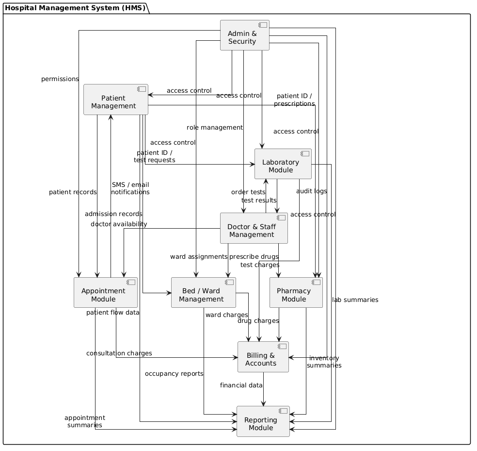

# System Modular Architecture Analysis

## Functional Decomposition
The following technical list details all identified modules for the CityCare Hospital Management System (HMS), detailing their specific responsibilities and how they achieve functional independence through high cohesion:

- **Patient Management**: Handles all patient-facing data operations — registration of inpatient and outpatient records, updating demographic and clinical information, retrieval of complete medical history, and generation of unique Patient IDs. This module is the primary data source for patient identity across the entire HMS.

- **Doctor & Staff Management**: Stores and manages physician and staff profiles, their specialization records, schedules, and ward/surgery assignments. Achieves cohesion by consolidating all human-resource-related clinical data into a single authoritative module.

- **Appointment Module**: Manages the complete appointment lifecycle — booking, modification, cancellation, and doctor availability lookups. Responsible for dispatching SMS/email notifications to patients. Coupled to Patient Management (for patient records) and Doctor & Staff Management (for availability).

- **Billing & Accounts**: Generates bills aggregating charges from consultations (via Appointment Module), drug issuance (via Pharmacy), lab tests (via Laboratory), and ward stays (via Bed/Ward Management). Processes payments across cash, card, and insurance channels and produces printed/digital invoices.

- **Pharmacy Module**: Manages the complete drug inventory lifecycle — stock tracking, drug issuance to patients based on prescriptions, monitoring of expiry dates, and automated reorder-level alerts. Receives prescription data from Doctor & Staff Management and patient identity from Patient Management.

- **Laboratory Module**: Handles lab test request recording, result storage and retrieval, and automated notification to doctors and patients when results are finalized. Receives test orders from Doctor & Staff Management and patient context from Patient Management.

- **Bed / Ward Management**: Manages inpatient admissions, bed allocation, real-time bed availability tracking, and ward occupancy reporting. Coupled to Patient Management (for admission records) and Doctor & Staff Management (for ward assignments).

- **Reporting Module**: Aggregates and compiles operational and financial data from all other modules — generating daily, weekly, and monthly reports. Exports billing summaries, appointment analytics, inventory reports, lab summaries, and occupancy metrics. Enables performance analysis (e.g., patient flow, revenue).

- **Admin & Security Module**: Governs system-wide user role management (admin, doctor, receptionist, lab technician), role-based access control (RBAC), fine-grained permissions, and audit logging for all sensitive operations. This module enforces security policies across every other module in the HMS.

## Inter-Module Communication
The data flow and coupling between the modules is designed to maintain low coupling while enabling necessary information exchange:

- **Patient Management → Appointment Module**: Provides patient records required for booking appointments.
- **Doctor & Staff Management → Appointment Module**: Supplies doctor availability data for scheduling.
- **Appointment Module → Billing & Accounts**: Forwards consultation charges for bill generation.
- **Pharmacy Module → Billing & Accounts**: Transmits drug issuance charges.
- **Laboratory Module → Billing & Accounts**: Sends lab test charges.
- **Bed/Ward Management → Billing & Accounts**: Reports ward stay charges.
- **Patient Management → Laboratory Module**: Provides patient ID and test request context.
- **Patient Management → Pharmacy Module**: Provides patient ID and prescription context.
- **Doctor & Staff Management → Laboratory Module**: Orders lab tests for patients.
- **Doctor & Staff Management → Pharmacy Module**: Issues drug prescriptions.
- **Laboratory Module → Doctor & Staff Management**: Returns completed test results.
- **Patient Management → Bed/Ward Management**: Supplies admission records.
- **Doctor & Staff Management → Bed/Ward Management**: Provides ward assignment directives.
- **Appointment Module → Patient Management**: Sends SMS/email notification triggers.
- **All Operational Modules → Reporting Module**: Each module (Patient, Appointment, Billing, Pharmacy, Lab, Bed/Ward) feeds its operational data into the Reporting Module for aggregation.
- **Admin & Security Module → All Modules**: Enforces access control, role management, permissions, and audit logging across every module in the system.

## Component Diagram

