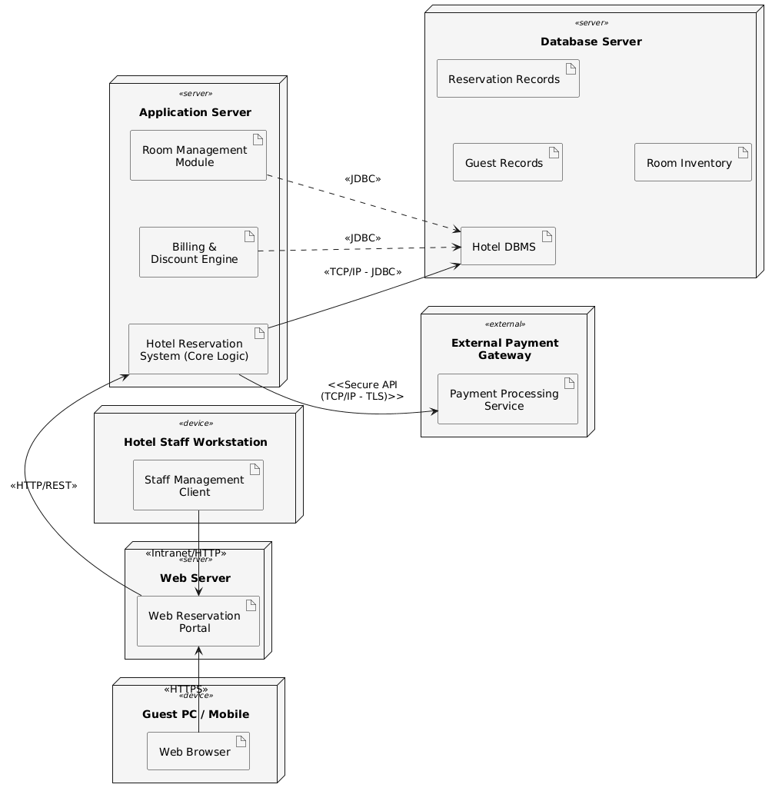

# System Deployment Architecture — Paradise Hotel Reservation System

## Physical Nodes and Artifacts

The Paradise Hotel online reservation system is distributed across six physical nodes:

| Node | Type | Deployed Artifacts |
|---|---|---|
| **Guest PC / Mobile** | Client Device | Web Browser |
| **Hotel Staff Workstation** | Internal Device | Staff Management Client |
| **Web Server** | Server | Web Reservation Portal |
| **Application Server** | Server | Hotel Reservation System (Core Logic), Billing & Discount Engine, Room Management Module |
| **Database Server** | Server | Hotel DBMS, Guest Records, Reservation Records, Room Inventory |
| **External Payment Gateway** | External Service | Payment Processing Service |

**Node Details:**
- **Guest PC / Mobile** — End-user device used by guests (regular and VIP) to browse rooms, make/modify/cancel reservations (max 2 for regular, unlimited for VIP), and process payments.
- **Hotel Staff Workstation** — Internal device used by Reservation Clerks (handle walk-in/phone reservations) and Hotel Managers (add/remove rooms, alter reservations, issue notices).
- **Application Server** — Central processing hub running three key artifacts: the core reservation logic (SPL-based), billing/discount engine (long stays, VIP, off-peak discounts), and room management module.
- **Database Server** — Persistent storage for all hotel data: guest profiles, reservation records, room inventory, and billing history.
- **External Payment Gateway** — Third-party service for processing credit card and electronic payments.

## Network Communication

| Source | Destination | Protocol | Purpose |
|---|---|---|---|
| Guest PC / Mobile | Web Server | HTTPS | Secure guest access to reservation portal |
| Hotel Staff Workstation | Web Server | Intranet / HTTP | Internal staff access to management interface |
| Web Server | Application Server | HTTP / REST | Request routing to core business logic |
| Application Server | Database Server | TCP/IP — JDBC | Data persistence and retrieval |
| Application Server | External Payment Gateway | Secure API (TCP/IP — TLS) | Credit card and electronic payment processing |

## Architecture Diagram

