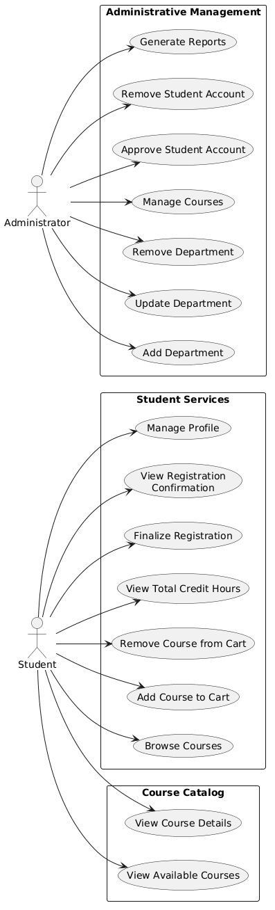
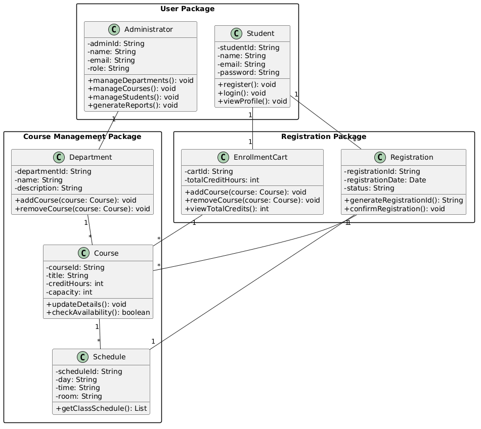

# Experiment 10 - Logical Organization with Package Diagrams

## Task 1 & 2: Use Case Diagram and Packages

The Online Course Registration System involves two actors — **Student** and **Administrator** — whose use cases are organized into three packages as defined by the lab manual:

| Package | Use Cases | Actor(s) |
|---|---|---|
| **Student Services** | Browse Courses, Add Course to Cart, Remove Course from Cart, View Total Credit Hours, Finalize Registration, View Registration Confirmation, Manage Profile | Student |
| **Administrative Management** | Add Department, Update Department, Remove Department, Manage Courses, Approve Student Account, Remove Student Account, Generate Reports | Administrator |
| **Course Catalog** | View Available Courses, View Course Details | Student |

- **Student Services** encapsulates all student-facing enrollment and profile operations — from cart management through final registration confirmation.
- **Administrative Management** consolidates all administrative CRUD operations: department lifecycle, course governance, student account approval, and reporting.
- **Course Catalog** isolates the read-only course browsing functionality, serving as the entry point for students to discover available courses before enrollment.

## Task 3 & 4: Identified Classes and Packages

The lab manual identifies **7 classes**, strictly grouped into **3 packages**:

| Package | Classes | Mapping Rationale |
|---|---|---|
| **User Package** | `Student`, `Administrator` | Groups all human actors/entities that interact with the system. Separates identity and authentication concerns from domain logic. |
| **Course Management Package** | `Course`, `Department`, `Schedule` | Contains the core academic domain entities. `Department` aggregates `Course` objects; `Schedule` associates time/location with courses. |
| **Registration Package** | `EnrollmentCart`, `Registration` | Encapsulates the transactional enrollment workflow — from temporary cart selections (`EnrollmentCart`) to finalized registration records (`Registration`). |

**Key Relationships:**
- `Student` → `EnrollmentCart` (1:1) — each student has one active cart
- `Student` → `Registration` (1:*) — a student can have multiple registrations
- `EnrollmentCart` → `Course` (*:*) — cart holds multiple course selections
- `Registration` → `Course` (1:*) — registration confirms enrolled courses
- `Registration` → `Schedule` (1:1) — registration produces a class schedule
- `Department` → `Course` (1:*) — department contains multiple courses
- `Administrator` → `Department` (1:*) — admin manages departments

